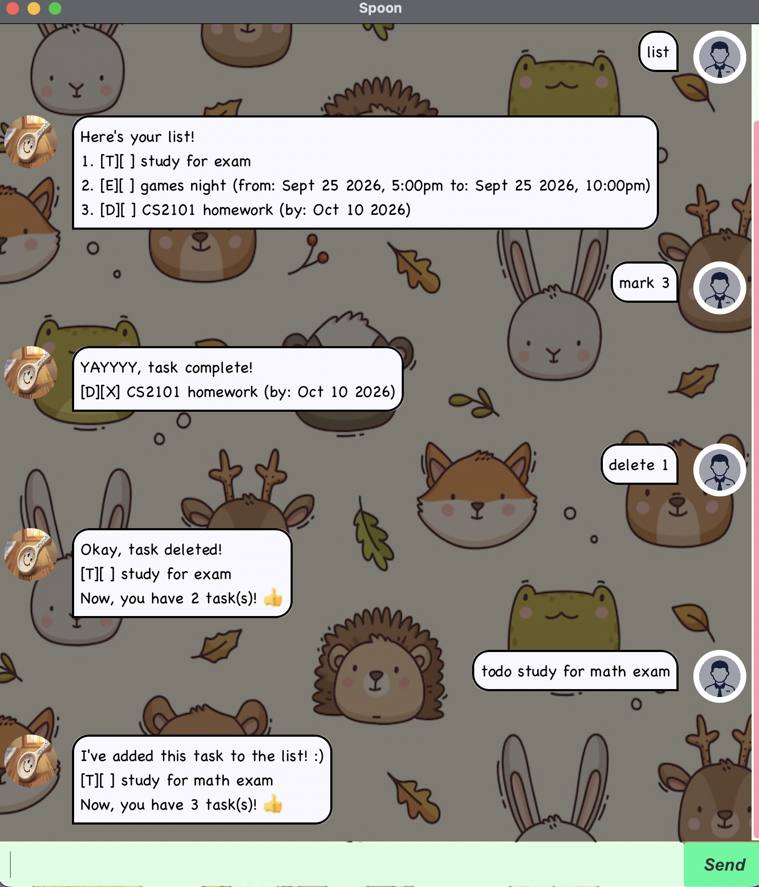

# Spoon - User Guide



**Spoon** is a lightweight, friendly desktop task-tracking chatbot optimized for fast command-line typists who prefer a clean graphical chat interface.
Keep track of what you need to do, upcoming deadlines, and multi-day events without taking your hands off the keyboard.

---

## Quick Start

1. Ensure you have **Java 25** installed on your computer (for Mac users, it must be the [**Java 25 JDK+FX Azul**](https://www.azul.com/downloads/?version=java-25-lts&os=macos&package=jdk-fx#zulu) distribution.
2. Download the latest `spoon.jar` file from our releases.
3. Place the `.jar` file in the folder you want to store your task history.
4. Open your terminal, navigate to the folder (using `cd`), and run:
   ```bash
   java -jar spoon.jar

# Features

## Adding Tasks

### 1. Add a To-Do: `todo`
Adds a simple task without any associated date or time.
* **Format:** `todo <description>`
* **Example:** `todo borrow library book`

### 2. Add a Deadline: `deadline`
Adds a task that must be completed by a specified date/time.
* **Format:** `deadline <description> /by <dd/MM/yyyy [HHmm]>`
* **Example:** `deadline submit CS2103T pull request /by 19/09/2026 2359`

### 3. Add an Event: `event`
Adds a task spanning a defined time range. The end date/time must not precede the start date/time.
* **Format:** `event <description> /from <dd/MM/yyyy [HHmm]> /to <dd/MM/yyyy [HHmm]>`
* **Example:** `event project hackathon /from 20/09/2026 0900 /to 21/09/2026 1800`

---

## Managing Tasks

### 4. List All Tasks: `list`
Displays every task in your list along with its status, type tag, and index.
* **Format:** `list`

### 5. Mark a Task as Done: `mark`
Marks a specific task as completed.
* **Format:** `mark <task_index>`
* **Example:** `mark 2`

### 6. Unmark a Task: `unmark`
Reverts a completed task back to incomplete status.
* **Format:** `unmark <task_index>`
* **Example:** `unmark 2`

### 7. Delete a Task: `delete`
Removes a task completely from your list.
* **Format:** `delete <task_index>`
* **Example:** `delete 1`

---

## Finding & Filtering Tasks

### 8. Find by Keyword: `find`
Finds all tasks whose descriptions contain any of the specified search keywords (case-insensitive).
* **Format:** `find <keyword> [additional_keywords]...`
* **Example:** `find book report`

### 9. Filter Tasks on a Date: `on`
Shows all deadlines due on, or events occurring across, a target date.
* **Format:** `on <dd/MM/yyyy>`
* **Example:** `on 20/09/2026`

### 10. Filter Tasks Due by a Date: `by`
Shows all deadlines and events that fall on or prior to the target date.
* **Format:** `by <dd/MM/yyyy>`
* **Example:** `by 25/09/2026`

---

## General Commands

### 11. View Help: `help`
Displays a quick reference sheet of all available commands.
* **Format:** `help`

### 12. Exit the App: `bye`
Exits Spoon and automatically saves your task list to disk.
* **Format:** `bye`

---

## Command Summary

| Action | Format | Example |
| :--- | :--- | :--- |
| **Help** | `help` | `help` |
| **List** | `list` | `list` |
| **Todo** | `todo <desc>` | `todo return laptop charger` |
| **Deadline** | `deadline <desc> /by <date [time]>` | `deadline finish quiz /by 22/09/2026` |
| **Event** | `event <desc> /from <date [time]> /to <date [time]>` | `event camp /from 01/10/2026 /to 03/10/2026` |
| **Mark** | `mark <index>` | `mark 1` |
| **Unmark** | `unmark <index>` | `unmark 1` |
| **Delete** | `delete <index>` | `delete 3` |
| **Find** | `find <word> [words...]` | `find assignment essay` |
| **Tasks On** | `on <dd/MM/yyyy>` | `on 01/10/2026` |
| **Tasks By** | `by <dd/MM/yyyy>` | `by 05/10/2026` |
| **Exit** | `bye` | `bye` |

## Data Storage and Loading

Spoon automatically manages and persists your task list across sessions. You do not need to manually save your data before exiting the app.

---

### Saving Data

* Task data is saved automatically whenever you execute commands that modify the list (such as `todo`, `deadline`, `event`, `mark`, `unmark`, or `delete`).
* The data is stored in a plain-text file located at:
  ```text
  ./data/spoon.txt
